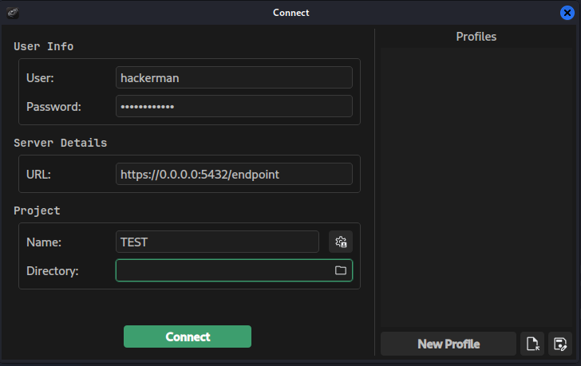
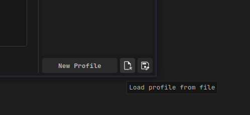

# LAB 1 — Configure and Setup AdaptixC2

---

## Task 1 — Install and Build Adaptix

### Part 1 — Install Dependencies

Install the system packages required by Extension-Kit and the cross-compilation toolchain:
```bash
sudo apt install -y \
  g++-mingw-w64-x86-64-posix \
  gcc-mingw-w64-x86-64-posix \
  mingw-w64-tools \
  default-jre \
  gcc-mingw-w64-x86-64 \
  clang \
  lld \
  make \
  docker-buildx-plugin
```

### Part 2 — Run Adaptix Pre-Install Scripts

Download and install Go, build dependencies, and set up the server and client build environments:
```bash
cd /opt/AdaptixC2
sudo chmod +x ./pre_install_linux_all.sh
sudo ./pre_install_linux_all.sh server
sudo ./pre_install_linux_all.sh client
```

### Part 3 — Add CrystalForge Extender

Clone CrystalForge into the Adaptix extenders directory and register it in the Go workspace:
```bash
sudo git clone https://github.com/k1ng0fn0th1ng/CrystalForge.git /opt/AdaptixC2/AdaptixServer/extenders/CrystalForge
cd /opt/AdaptixC2/AdaptixServer
sudo go work use extenders/CrystalForge
sudo go work sync
```

### Part 4 — Build AdaptixC2

```bash
cd /opt/AdaptixC2
sudo make all
```

### Part 5 — Fix CrystalForge Crystal Palace Linker

The Crystal Palace 06.29.26 release removed the standalone `link` binary in favour of `cpl link`. Create a wrapper so CrystalForge can find it:
```bash
cat << 'EOF' | sudo tee /opt/AdaptixC2/dist/extenders/CrystalForge/crystal_palace/link
#!/usr/bin/env bash
exec "$(dirname "$0")/cpl" link "$@"
EOF
sudo chmod +x /opt/AdaptixC2/dist/extenders/CrystalForge/crystal_palace/link
```

### Part 6 — Build Extension-Kit and Register CrystalForge

Build the Extension-Kit, patch `add_agent.sh`, and register the CrystalForge agent:

```bash
cd /opt/extension-kit
sudo make all
```

Back up the original script and rewrite `add_agent.sh` it with the corrected `sed` pattern to catch all agents:

```bash
sudo cp /opt/extension-kit/add_agent.sh /opt/extension-kit/add_agent.sh.bak
sudo tee /opt/extension-kit/add_agent.sh << 'SCRIPT'
#!/bin/bash

if [ -z "$1" ]; then
    echo "Use: $0 <agent_name>"
    echo "Example: $0 kharon"
    exit 1
fi

AGENT_NAME="$1"

find . -type f -name "*.axs" | while read -r file; do
    if grep -q 'register_commands_group' "$file" && grep -q '"beacon", "gopher"' "$file"; then
        if ! grep -q "$AGENT_NAME" "$file"; then
            echo "[+] Update file: $file"
            sed -i 's/\["beacon", "gopher"\([^]]*\)\]/["beacon", "gopher"\1, "'"$AGENT_NAME"'"]/g' "$file"
        else
            echo "[!] Agent $AGENT_NAME already exists in $file"
        fi
    fi
done

echo "--- Complete ---"
SCRIPT
```

```bash
sudo ./add_agent.sh CrystalForge
```

### Part 7 — Build Kharon

```bash
cd /opt/Kharon
sudo chmod +x setup_kharon.sh
sudo ./setup_kharon.sh --ax /opt/AdaptixC2/ --action all
```

### Part 8 — Build Reflectra

```bash
cd /opt/reflectra
sudo chmod +x install.sh
sudo ./install.sh
```

The Crystal Palace 06.29.26 release removed the standalone `link` binary in favour of `cpl link`. Reflectra's `build.sh` has not yet been updated to use the new interface. Create a wrapper to bridge the two:
```bash
sudo mkdir -p /opt/reflectra/dist
cat << 'EOF' | sudo tee /opt/reflectra/dist/link
#!/usr/bin/env bash
exec "$(dirname "$0")/../crystalpalace/cpl" link "$@"
EOF
sudo chmod +x /opt/reflectra/dist/link
```

### Part 9 — Register Extenders in profile.yaml

Add Kharon, CrystalForge, and their listeners to the Adaptix server profile:
```bash
cd /opt/AdaptixC2/dist/
sudo sed -i 's|    - "extenders/gopher_agent/config.yaml"|    - "extenders/gopher_agent/config.yaml"\n    - "extenders/agent_kharon/config.yaml"\n    - "extenders/listener_kharon_http/config.yaml"\n    - "extenders/CrystalForge/config.yaml"|' profile.yaml
cat profile.yaml
```

### Part 10 — Copy Client to Desktop and Create SSL Certificates

```bash
cp /opt/AdaptixC2/dist/AdaptixClient ~/Desktop/
chmod +x ~/Desktop/AdaptixClient

sudo openssl req -x509 -nodes -newkey rsa:2048 \
  -keyout /opt/AdaptixC2/dist/server.rsa.key \
  -out /opt/AdaptixC2/dist/server.rsa.crt \
  -days 365 \
  -subj "/C=US/ST=State/L=City/O=Organization/OU=Unit/CN=localhost"
```

---

## Task 2 — Configure and Start the Server

- Modify the server profile — change the port to `5432`, the password to `CyberShield2026!!`:
```bash
cd /opt/AdaptixC2/dist
sudo vim profile.yaml
```

- Start the server:
```bash
sudo ./adaptixserver -debug -profile profile.yaml
```

- Using Firefox navigate to `https://192.168.57.40:5432/endpoint`

> :no_entry: ***OPSEC:*** A default Adaptix endpoint path is a clear indicator of compromise — always change it in the profile before deployment.

- Stop the server
- Edit `404page.html` and change the `<h1>` to `Cyber Shield 404`
- Start the server again

---

## Task 3 — Connect to the Team Server

- Double-click the Adaptix client on the Kali desktop
- Enter the connection information:
    - **User:** Your `leet` hacker username
    - **Password:** Password set in `profile.yaml`
    - **URL:** Server IP, port, and endpoint
    - **Project Name:** Local project name (default location is `~/AdaptixProjects`)



---

## Task 4 — Load Scripts

- Click `Extensions` (upper left of client) → `Script manager`
- Right-click in the AxScript manager window → `Load new`
- Navigate to `Other Locations` → `Computer`
- Select `persistask.axs` in `/opt/BOFs/persistask` → `Open`
- Status should show `Enabled`

- Load these additional scripts:
    - `/opt/AdaptixC2/dist/extenders/listener_kharon_http/ax_config.axs`
    - `/opt/AdaptixC2/dist/extenders/agent_kharon/ax_config.axs`
    - `/opt/AdaptixC2/dist/extenders/CrystalForge/ax_config.axs`
    - `/opt/extension-kit/extension-kit.axs`
    - `/opt/BOFs/cs-sa/SA/TrustedSec-SA-BOFs.axs`
    - `/opt/BOFs/svcmodprivesc/svcmodprivesc.axs`
    - `/opt/BOFs/cs-remote-ops/Injection/TrustedSec-Remote-Injection.axs`
    - `/opt/BOFs/cs-remote-ops/Remote/TrustedSec-Remote-Ops.axs`
    - `/opt/PostEx-Arsenal/kh_modules.axs`
    - `/opt/BOFs/persistask/persistask.axs`
    - `/opt/BOFs/TimeStomp/dist/timestomp.axs`

---

## Task 5 — Create Listeners

To create a listener: click the `headphone` icon (upper left) → right-click in the Listeners window → `Create`

### Part 1 — HTTP

- Name: `HTTP`
- Protocol: `external (http)`
- Callback address: 
  - `socialbabies.com:443`
  - `bigjohnstractors.com:443`
  - `192.168.57.40:443`
- Method: `Get`
- Click `Generate` to generate a new encryption key
- Click `Use SSL (HTTPS)`
- Click `Create`

### Part 2 — GopherTCP

- Name: `GopherTCP`
- Protocol: `external (tcp)`
- Callback address: `192.168.57.40:4444`
- TCP banner: `test server`
- Click `Generate` to generate a new encryption key
- Click `How generate?` and copy the `Generate mTLS certificates` instructions
- Open a terminal on Kali, `cd` to `~/AdaptixProjects/<YOUR PROJECT>` and paste the instructions to generate certificates
- Click `Use mTLS` and add the respective keys:
    - Client and Server keys end with `.key`
    - Client and Server certificates end with `.crt`
    - CA certificate should be `ca.crt`
- Click `Create`

### Part 3 — TCP (Internal)

- Name: `TCP-9001`
- Protocol: `internal (bind_tcp)`
- Bind Port: `9001`
- Prepend data: `\x11\xabSimple\x21plan\xa`
- Click `Generate` to generate a new encryption key
- Click `Create`

### Part 4 — SMB (Internal)

- Name: `SMB`
- Protocol: `internal (bind_smb)`
- On the Windows host, open PowerShell and list existing named pipes — copy a random pipe name and change the last four digits:
```powershell
ls \\.\pipe\
```
- Pipename (C2): paste the modified pipe name
- Click `Generate` to generate a new encryption key
- Click `Create`

### Part 5 — KharonHTTP

- Name: `KharonHTTP`
- Protocol: `external (http)`
- Config: `KharonHTTP`
- Host & port (Bind): `0.0.0.0 8443`
- Open a terminal on Kali and `cd` to `~/AdaptixProjects/<YOUR PROJECT>`:
```bash
jq '.callbacks[0].hosts = ["192.168.57.40:8443"]' /opt/Kharon/listener_kharon_http/profiles/example1.json > example1.json && openssl req -x509 -nodes -newkey rsa:2048 -keyout kharon.rsa.key -out kharon.rsa.crt -days 365 -subj "/C=US/ST=State/L=City/O=Organization/OU=Unit/CN=localhost"
```
- Upload Profile: click the folder icon and select `example1.json`
- Click `Use SSL (HTTPS)` and select `kharon.rsa.crt` and `kharon.rsa.key`
- Click `Create`

### Part 6 — Load from Profile File

- Click `Load profile from file`



- Select `LoadConfig.json` from the LAB1 folder
- Click `Create`

> **Note:** The bind port and callback port are intentionally different — this is how redirectors are configured.
