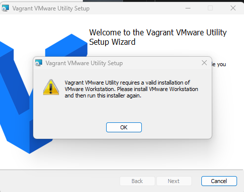
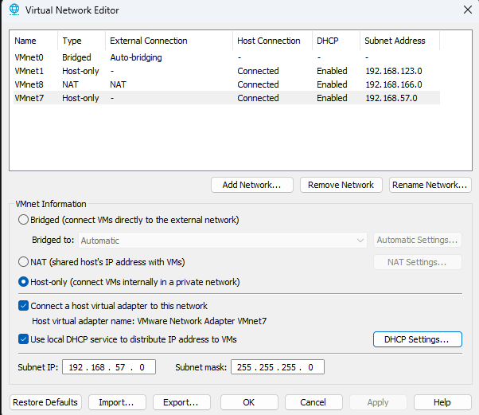

# Lab Setup

## Host Requirements

> These are the minimum specs for your Windows laptop to run the full lab.

> **Note:** You must have local administrator permissions on your computer to install software and complete the setup steps.

| Resource | Minimum | Recommended |
|----------|---------|-------------|
| RAM | 24 GB | 32 GB |
| CPU Cores | 6 cores | 8+ cores |
| Free Disk Space | 270 GB | 350 GB |
| OS | Windows 10/11 64-bit | Windows 11 64-bit |

### Per-VM Breakdown

| VM | Role | RAM | CPUs | Disk |
|----|------|-----|------|------|
| Kali Linux | Attacker | 8+ GB | 2 | 128 GB |
| DC01 | Windows Server 2019 Domain Controller | 8 GB | 2 | 60 GB |
| WS01 | Windows 11 Workstation | 8 GB | 2 | 80 GB |
| **Total** | | **24 GB** | **6** | **268 GB** |


---

## Step 1 — Disable Hyper-V (Required)

VirtualBox and VMware require hardware virtualization, which conflicts with Hyper-V. Run the following from an **admin terminal** and reboot before continuing.

```powershell
Disable-WindowsOptionalFeature -Online -FeatureName Microsoft-Hyper-V-All
bcdedit /set hypervisorlaunchtype off
```

> If you skip this step, VMs may fail to start or run extremely slowly.

---

## Step 2 — Install a Hypervisor

Choose **one**:
### VirtualBox
- Download: https://www.virtualbox.org/wiki/Downloads
- Also download the **VirtualBox Extension Pack** from the same page and install it:
  1. Open VirtualBox
  2. Go to **File > Tools > Extensions**
  3. Click the **Install** button and browse to the downloaded `.vbox-extpack` file
  4. Accept the license agreement when prompted

### VMware Workstation 
- Download: https://www.vmware.com/products/desktop-hypervisor/workstation-and-fusion
- Requires a free Broadcom account to download
- Also download and install the **VMware Vagrant Utility**:
  https://releases.hashicorp.com/vagrant-vmware-utility/1.0.24/vagrant-vmware-utility_1.0.24_windows_amd64.msi
 
> Note: If you recieve the error below run the fix indentified here: https://github.com/hashicorp/vagrant-vmware-desktop/issues/177  

  


---

## Step 3 — Install Visual C++ 2019 Runtime

Required by Vagrant and some VM tools.

- Download: https://aka.ms/vs/17/release/vc_redist.x64.exe

---

## Step 4 — Install Vagrant

- Download: https://developer.hashicorp.com/vagrant/install
- Reboot after installation if prompted

---

## Step 5 — Install Vagrant Plugins

Open a terminal and run the command for your hypervisor:

### VirtualBox
```powershell
vagrant plugin install vagrant-reload vagrant-vbguest winrm winrm-fs winrm-elevated
```

### VMware
```powershell
vagrant plugin install vagrant-reload vagrant-vmware-desktop winrm winrm-fs winrm-elevated
```

---

## Step 6 — Deploy Lab VMs

```powershell
git clone https://github.com/Valkyrie-Security/CS26AdaptixClass.git
cd CS26AdaptixClass\virtualmachines\<virtualbox or vmware>
vagrant up
```

This will provision:
- **DC01** — Windows Server 2019 Domain Controller (`192.168.57.10`)
- **WS01** — Windows 11 Workstation (`192.168.57.31`)

> Credentials for both Windows hosts: **username:** `vagrant` / **password:** `vagrant`


> If you receive this error, create the network in vmware "Virtual Network Editor"  
```powershell
Vagrant failed to create a new VMware networking device. The following
error message was generated while attempting to create a new device:

  Failed to create new device

Please resolve any problems reported in the error message above and
```  

  
---

## Step 7 — Set Up Kali Linux

Create a Kali Linux VM manually with the following specs:

| Setting | Value |
|---------|-------|
| Disk | 128 GB |
| RAM | 8 GB |
| CPUs | 2 |
| NIC 1 | Bridged (or NAT for VMware) |
| NIC 2 | Internal network shared with DC01 and WS01 |

### Run the Lab Setup Script

Boot into Kali, open a terminal, and run:

```bash
git clone https://github.com/Valkyrie-Security/CS26AdaptixClass.git ~/CS26AdaptixClass
cd ~/CS26AdaptixClass
chmod +x setup_lab.sh
./setup_lab.sh
```

The script will:
1. Prompt for your sudo password (used throughout — enter it once)
2. Detect and configure `eth1` with static IP `192.168.57.40`
3. Prompt you to log into DC01 and WS01 and ping `192.168.57.40` to verify connectivity
4. Update the system and install OpenSSH Server and Ansible
5. Detect hypervisor and install the appropriate guest additions
6. Clone and run the Kali Ansible playbook (`main.yml`)
7. Run the lab environment Ansible playbook (`build.yml`)

> Logs are written to `setup.log`, `ansible_kali.log`, and `ansible_lab.log` in the home directory.

### Network Layout

```
192.168.57.0/24  (Internal Lab Network)
├── 192.168.57.10   DC01   (Windows Server 2019)
├── 192.168.57.31   WS01   (Windows 11)
└── 192.168.57.40   Kali   (Attacker)
```

---

## Troubleshooting

<details>
<summary><strong>Hyper-V still active after reboot</strong></summary>

Run from an admin terminal on your host:
```powershell
systeminfo | findstr /i "Hyper-V"
bcdedit | findstr /i hypervisorlaunchtype
# If output shows "On", re-run:
bcdedit /set hypervisorlaunchtype off
```

</details>

<details>
<summary><strong>Windows 11 VM fails to boot</strong></summary>

Run from an admin terminal on your host:
```powershell
bcdedit /set hypervisorlaunchtype off
```
Then reboot the host and retry `vagrant up`.

</details>

<details>
<summary><strong>Kali VM login issues (GUI fails to load)</strong></summary>

At the Kali login screen press `Ctrl + Alt + F2` to open a terminal, then:
```bash
sudo dpkg --remove --force-remove-reinstreq python3-pyinstaller-hooks-contrib
sudo apt clean
sudo apt update
sudo apt --fix-broken install
```

</details>

<details>
<summary><strong>eth1 not found on Kali</strong></summary>

Ensure the second NIC is attached in your hypervisor settings before running `setup_lab.sh`. The script will exit with an error if `eth1` is not present.

</details>

<details>
<summary><strong>Windows 11 VM is unresponsive or cannot be interacted with (VMware)</strong></summary>

If the Windows 11 VM starts but mouse input is not working, VMware Tools may be in a broken state. You can often reinstall VMware Tools using only the keyboard — no mouse required:

1. In VMware Workstation, go to **VM > Reinstall VMware Tools**. This mounts the VMware Tools installer as a virtual CD drive inside the guest (usually `D:\`).
2. Send **Ctrl+Alt+Del** to the VM using **VM > Send Ctrl+Alt+Del** from the menu bar.
3. Select **Task Manager** using the arrow keys and **Enter**.
4. Once Task Manager is open, press **Windows Key + R** to open the Run dialog.
5. Type `cmd.exe` and press **Enter**.
6. In the Command Prompt, type the following and press **Enter**:
   ```
   D:\setup.exe
   ```
7. Press **Alt+Tab** to bring the installer window into focus.
8. Use **Tab** to navigate between buttons and **Enter** to confirm selections, completing the installation without a mouse.

If the VM is too unresponsive to follow the steps above, fall back to a full power cycle:

1. Shut down the VM from VMware Workstation (**VM > Power > Shut Down Guest**, or force power off if needed)
2. Power the VM back on and wait for it to fully boot
3. From the VMware menu, go to **VM > Reinstall VMware Tools** and complete the installer inside the guest

Once VMware Tools is reinstalled, input and display integration should be restored.

</details>
